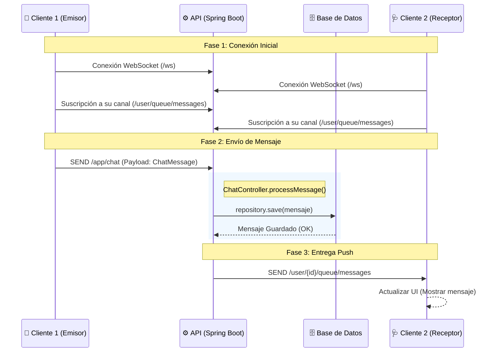
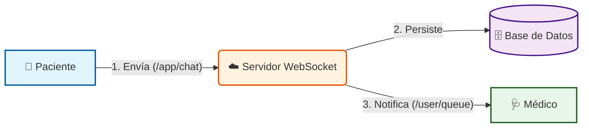

# Documentación del Flujo de Chat (WebSocket)

Este documento detalla el flujo de comunicación en tiempo real entre Paciente y Médico utilizando WebSockets.

## 1. Diagrama de Secuencia (Técnico)
Este diagrama representa el paso a paso exacto de los mensajes a través de los controladores y servicios de Spring Boot.

## 2. Diagrama de Arquitectura (Visual)
Este diagrama es más conceptual, ideal para presentaciones o visión general.

## Referencia de Código

*   **Configuración**: `WebSocketConfig.java` define los endpoints `/ws` y el broker `/user`.
*   **Controlador**: `ChatController.java` maneja el mensaje entrante en `@MessageMapping("/chat")` y lo reenvía con `simpMessagingTemplate.convertAndSendToUser()`.
*   **Modelo de Datos**: `ChatMessage` contiene el `senderId`, `recipientId` y `content`.
