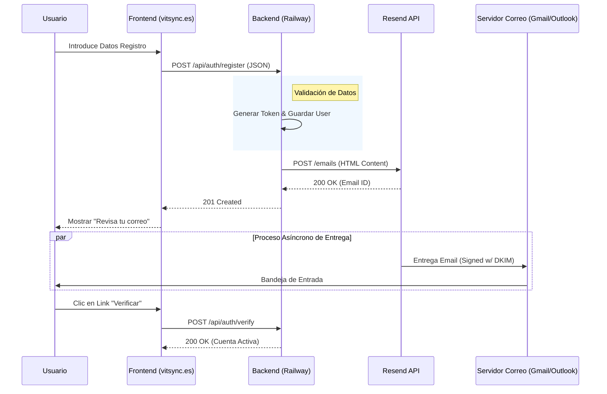

# Documentación Técnica: Infraestructura de Notificaciones y Dominio vitsync.es

**Proyecto:** VitSync  
**Versión:** 1.0.0  
**Fecha:** 23 de Enero, 2026  
**Responsable Técnica:** Antigravity Agent

---

## 1. Visión General de la Arquitectura

El sistema de notificaciones de VitSync se ha desacoplado de los protocolos SMTP tradicionales para adoptar una arquitectura basada en APIs RESTful, garantizando escalabilidad, trazabilidad y compatibilidad con entornos Cloud modernos (Railway).

### 1.1 Diagrama de Componentes del Sistema

```mermaid
graph TD
    User((Usuario Final)) -->|HTTPS| CDN[Vercel CDN]
    CDN -->|Load WebApp| FE[Frontend Vue.js]
    
    subgraph "Dominio vitsync.es"
        FE -->|/api/auth| API[Backend Spring Boot]
    end
    
    subgraph "Infraestructura Externa"
        API -->|POST /emails| Resend[Resend API Gateway]
        Resend -->|DKIM/SPF Auth| SMTP[AWS SES (Underlying)]
        DNS[IONOS DNS] -.->|Verifica| SMTP
    end
    
    SMTP -->|Entrega| EmailClient[Cliente de Correo]
    EmailClient --> User
```

---

## 2. Flujo de Datos: Verificación de Cuenta

El proceso crítico de registro y validación de identidad sigue un flujo síncrono estricto para asegurar la entrega del token.

### 2.1 Diagrama de Secuencia



---

## 3. Configuración de Dominio e Infraestructura

La migración a `vitsync.es` implicó la orquestación de múltiples servicios DNS.

### 3.1 Topología DNS (IONOS)

| Tipo | Host | Valor | Propósito | Estado |
|:---:|:---:|---|---|:---:|
| **A** | `@` | `216.198.79.1` | Apunta raíz a Vercel | ✅ Activo |
| **CNAME** | `www` | `cname.vercel-dns.com` | Subdominio www a Vercel | ✅ Activo |
| **MX** | `send` | `feedback-smtp...` | Retorno de Bounces (Resend) | ✅ Activo |
| **TXT** | `@` | `v=spf1 include:amazonses.com ~all` | Autorización SPF | ✅ Activo |
| **TXT** | `resend._domainkey` | `p=MIGfMA0G...` | Firma Criptográfica DKIM | ✅ Activo |

---

## 4. Gestión de Incidencias Operativas (Troubleshooting)

Durante el despliegue se identificaron y resolvieron tres incidentes críticos. A continuación se detalla el árbol de decisión para futuros diagnósticos.

### 4.1 Flujo de Diagnóstico de Errores

```mermaid
graph TD
    Start[Inicio: Error Detectado] --> Q1{¿Tipo de Error?}
    
    Q1 -->|CORS| CORS[Error Bloqueo Origen]
    Q1 -->|404| N404[Nginx Not Found]
    Q1 -->|Email| BOUNCE[Email Rebotado]

    %% Rama CORS
    CORS --> C1{¿Variable ENV definida?}
    C1 -->|Sí: Con espacios| C_Fix1[Acción: Trim Strings en Código]
    C1 -->|Sí: URL incorrecta| C_Fix2[Acción: Actualizar ENV en Railway]
    C_Fix1 --> End[Resuelto]
    C_Fix2 --> End

    %% Rama 404
    N404 --> N1{¿Registro AAAA presente?}
    N1 -->|Sí| N_Fix1[Acción: Eliminar IPv6 en IONOS]
    N1 -->|No| N_Fix2[Acción: Purgar Caché DNS Local]
    N_Fix1 --> End
    N_Fix2 --> End

    %% Rama Bounce
    BOUNCE --> B1{¿Mensaje de Error?}
    B1 -->|Transient| B_Fix1[Causa: Propagación DNS]
    B1 -->|Permanent Rejected| B_Fix2[Causa: Baja Reputación de Dominio Nuevo]
    B_Fix1 --> B_Wait[Acción: Esperar 1-2h]
    B_Fix2 --> B_Warm[Acción: Calentamiento de IP (24-48h)]
```

### 4.2 Detalle de Soluciones Técnicas Implementadas

#### 🔧 Incidente: Corrupción de Configuración CORS
*   **Problema:** La inyección de la variable `CORS_ALLOWED_ORIGINS` fallaba silenciosamente debido a espacios en blanco invisibles (`"url1, url2"`).
*   **Solución (Código):** Implementación de limpieza defensiva en `SecurityConfig.java`.
    ```java
    // Antes (Propenso a fallos)
    configuration.setAllowedOrigins(Arrays.asList(corsAllowedOrigins.split(",")));
    
    // Ahora (Robusto)
    configuration.setAllowedOrigins(Arrays.stream(corsAllowedOrigins.split(","))
        .map(String::trim) // Elimina espacios críticos
        .toList());
    ```

#### 🔧 Incidente: Conflicto de Resolución AAAA (IPv6)
*   **Problema:** Los navegadores modernos priorizaban el registro IPv6 de IONOS (Parking) sobre el IPv4 de Vercel.
*   **Solución:** Eliminación estricta de registros AAAA en la zona DNS.

---

## 5. Recomendaciones de Mantenimiento

1.  **Monitorización de Reputación**: Utilizar [Google Postmaster Tools](https://postmaster.google.com/) para vigilar la reputación del dominio `vitsync.es`.
2.  **Gestión de Variables**: Mantener `MAIL_FROM_ADDRESS` sin definir en Railway para aprovechar los valores por defecto del código, a menos que se requiera un cambio de remitente.
3.  **Renovación**: Recordar la renovación del dominio en IONOS (Enero 2027) o transferir a un proveedor con renovación automática preferente.

---
*Documentación generada automáticamente para VitSync Dev Team.*
